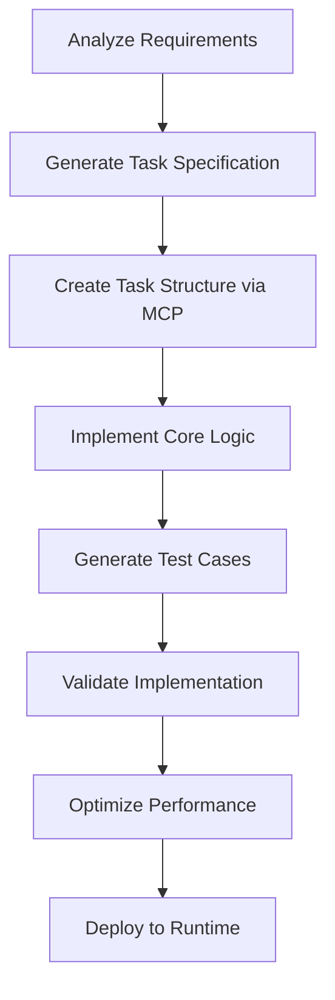
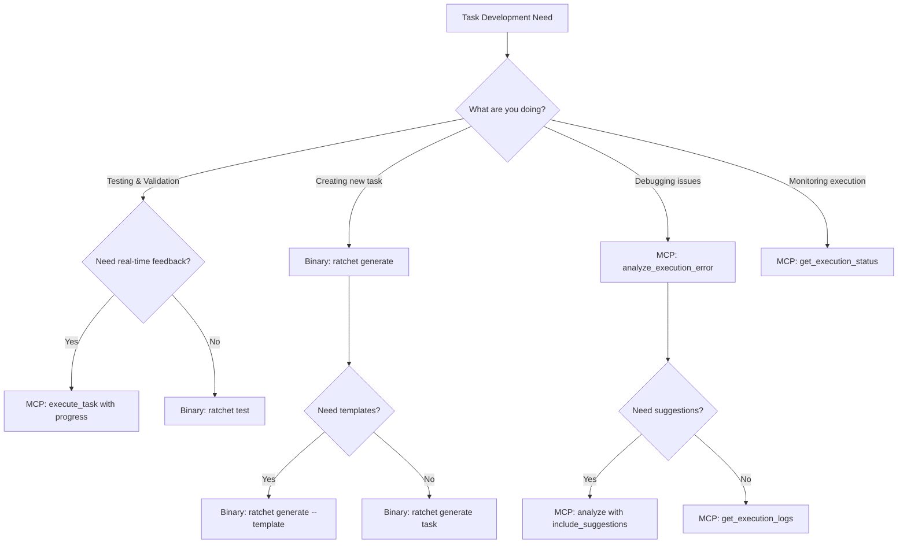

# LLM Guide: Developing Ratchet Tasks

This guide provides comprehensive instructions for Large Language Models (LLMs) to develop, test, and debug JavaScript tasks using the Ratchet platform. You can interact with Ratchet through direct binary invocation or via the Model Context Protocol (MCP) server.

## Table of Contents

1. [Setup and Configuration](#setup-and-configuration)
2. [Development Methods](#development-methods)
3. [Task Structure and Requirements](#task-structure-and-requirements)
4. [Binary Usage for Task Development](#binary-usage-for-task-development)
5. [MCP Server Usage](#mcp-server-usage)
6. [Development Workflow](#development-workflow)
7. [Testing and Debugging](#testing-and-debugging)
8. [Troubleshooting Guide](#troubleshooting-guide)
9. [Complete Examples](#complete-examples)

## Setup and Configuration

### Prerequisites

Before starting task development, ensure you have:

1. **Ratchet Binary**: The `ratchet` executable available in your PATH
2. **Working Directory**: A directory where you can create task files
3. **Configuration** (optional): A config file for advanced setups

### Initial Setup

#### 1. Verify Ratchet Installation

```bash
# Check if ratchet is available
ratchet --version

# Display help to see available commands
ratchet --help
```

#### 2. Create Working Directory

```bash
# Create a directory for your tasks
mkdir my-ratchet-tasks
cd my-ratchet-tasks
```

#### 3. Basic Configuration (Optional)

Create a minimal config file if needed:

```yaml
# config.yaml
execution:
  max_execution_duration: 60  # seconds
  validate_schemas: true

http:
  timeout: 30
  verify_ssl: true
```

Use with: `ratchet --config config.yaml [command]`

## Development Methods

Ratchet offers two primary ways to develop and test tasks:

### Method 1: Direct Binary Usage
- **Best for**: Quick development, testing, validation
- **Pros**: Simple, direct, no setup required
- **Use**: CLI commands like `ratchet run-once`, `ratchet test`, `ratchet validate`

### Method 2: MCP Server Integration  
- **Best for**: Interactive development, real-time monitoring, complex debugging
- **Pros**: Rich toolset, execution monitoring, error analysis
- **Use**: MCP tools through LLM integration

## Task Structure and Requirements

### Directory Structure

Every Ratchet task is a directory containing these files:

```
my-task/
├── metadata.json      # Task metadata and configuration
├── main.js           # JavaScript implementation (required)
├── input.schema.json # Input validation schema (required)
├── output.schema.json# Output validation schema (required)
└── tests/            # Test cases (optional but recommended)
    ├── test-001.json
    ├── test-002.json
    └── test-003.json
```

### Required Files

#### 1. metadata.json
```json
{
  "uuid": "550e8400-e29b-41d4-a716-446655440000",
  "version": "1.0.0",
  "label": "My Task",
  "description": "What this task does",
  "author": "LLM Assistant",
  "tags": ["api", "data"],
  "timeout": 30000,
  "memory_limit": "128MB"
}
```

#### 2. main.js (Function Wrapper Required)
```javascript
(function(input, context) {
    // Your task logic here
    // input: validated against input.schema.json
    // context: optional execution context
    
    try {
        const { param1, param2 } = input;
        
        // Your implementation
        const result = processData(param1, param2);
        
        return {
            result: result,
            timestamp: new Date().toISOString()
        };
    } catch (error) {
        throw new Error(`Task failed: ${error.message}`);
    }
})
```

**Critical Requirements:**
- Function must be wrapped: `(function(input, context) { ... })`
- No async/await - all operations must be synchronous
- Use built-in `fetch()` for HTTP requests
- No external modules or Node.js APIs

#### Function Wrapper Do's and Don'ts

```javascript
// ✅ CORRECT - Synchronous function wrapper
(function(input, context) {
    return { result: "immediate value" };
})

// ✅ CORRECT - Synchronous fetch usage
(function(input, context) {
    const response = fetch("https://api.example.com/data");
    if (response.ok) {
        return { data: response.body };
    } else {
        throw new NetworkError(`API returned ${response.status}`);
    }
})

// ✅ CORRECT - Proper error handling
(function(input, context) {
    try {
        const { apiKey, url } = input;
        if (!apiKey) {
            throw new DataError("API key is required");
        }
        const response = fetch(url, {
            headers: { "Authorization": `Bearer ${apiKey}` }
        });
        return { success: true, data: response.body };
    } catch (error) {
        throw new Error(`Task failed: ${error.message}`);
    }
})

// ❌ INCORRECT - Async/await not supported
(async function(input, context) {
    const data = await fetch(url); // This will fail
    return data;
})

// ❌ INCORRECT - Promise chains not supported
(function(input, context) {
    return fetch(url)
        .then(response => response.json()) // This will fail
        .then(data => ({ result: data }));
})

// ❌ INCORRECT - No external modules
(function(input, context) {
    const axios = require('axios'); // This will fail
    return axios.get(url);
})

// ❌ INCORRECT - No Node.js APIs
(function(input, context) {
    const fs = require('fs'); // This will fail
    const data = fs.readFileSync('file.txt');
    return { data };
})

// ❌ INCORRECT - Missing function wrapper
const myTask = (input, context) => { // This will fail
    return { result: "value" };
};
```

#### 3. input.schema.json
```json
{
  "$schema": "http://json-schema.org/draft-07/schema#",
  "type": "object",
  "required": ["param1"],
  "properties": {
    "param1": {
      "type": "string",
      "description": "Description of param1",
      "minLength": 1
    },
    "param2": {
      "type": "number",
      "description": "Optional parameter",
      "minimum": 0
    }
  }
}
```

#### 4. output.schema.json
```json
{
  "$schema": "http://json-schema.org/draft-07/schema#",
  "type": "object",
  "required": ["result", "timestamp"],
  "properties": {
    "result": {
      "type": "object",
      "description": "Task processing result"
    },
    "timestamp": {
      "type": "string",
      "format": "date-time",
      "description": "When task completed"
    }
  }
}
```

### Available JavaScript APIs

#### fetch(url, options, body) - HTTP Requests
```javascript
// GET request
const response = fetch("https://api.example.com/data");
if (response.ok) {
    const data = response.body;
    // Process response data
}

// POST request
const response = fetch(
    "https://api.example.com/create",
    { 
        method: "POST", 
        headers: { "Content-Type": "application/json" } 
    },
    { name: "example", value: 42 }
);
```

#### Error Types
```javascript
// Network-related errors
throw new NetworkError("Failed to connect to API");

// Data validation errors  
throw new DataError("Invalid response format");

// General task errors
throw new Error("Something went wrong");
```

#### Console Logging
```javascript
console.log("Debug information");
console.error("Error details");
console.warn("Warning message");
```

## Binary Usage for Task Development

### Development Commands

#### 1. Task Creation and Scaffolding

```bash
# ✅ STABLE - Create a new task with comprehensive scaffolding
ratchet generate task my-api-task \
  --label "API Integration Task" \
  --description "Fetches data from external API" \
  --template api \
  --include-tests \
  --include-docs

# ✅ STABLE - Create task from existing template
ratchet generate task weather-service \
  --from-template rest-api \
  --author "LLM Agent" \
  --tags "weather,api,external"

# ⚠️ EXPERIMENTAL - Create task with custom configuration
ratchet generate task data-processor \
  --timeout 60000 \
  --memory-limit "256MB" \
  --retry-attempts 3 \
  --input-validation strict

# 🚧 EXPERIMENTAL - Generate task from OpenAPI specification
ratchet generate task from-openapi \
  --spec-url "https://api.example.com/openapi.json" \
  --operation "getUserData" \
  --auto-test-cases

# 🚧 EXPERIMENTAL - Clone existing task for modification
ratchet clone task existing-task new-variation \
  --update-metadata \
  --clear-tests

# 🚧 EXPERIMENTAL - Update task metadata in batch
ratchet update task-metadata my-task \
  --timeout 45000 \
  --add-tag "production" \
  --set-version "2.0.0"

# 🚧 EXPERIMENTAL - Merge multiple tasks into one
ratchet merge tasks task1 task2 task3 \
  --output combined-task \
  --strategy sequential \
  --preserve-tests

# 🚧 EXPERIMENTAL - Extract common functionality
ratchet extract task my-task \
  --function "validateInput" \
  --to-library common-utils
```

**Legend:**
- ✅ **STABLE**: Fully implemented and tested
- ⚠️ **EXPERIMENTAL**: Implemented but may change in future versions
- 🚧 **FUTURE**: Planned feature, not yet implemented

#### 2. Comprehensive Validation and Analysis

```bash
# ✅ STABLE - Basic validation
ratchet validate my-api-task/

# 🚧 FUTURE - Deep validation with analysis
ratchet validate my-api-task/ \
  --deep \
  --analyze-performance \
  --check-security \
  --verify-dependencies

# 🚧 FUTURE - Validate with custom rules
ratchet validate my-api-task/ \
  --rules-file validation-rules.json \
  --fail-on-warnings \
  --output-format detailed

# 🚧 FUTURE - Cross-task validation (dependencies)
ratchet validate --workspace \
  --check-conflicts \
  --analyze-compatibility \
  --report conflicts-report.json

# 🚧 FUTURE - Real-time validation during development
ratchet validate my-api-task/ \
  --watch \
  --auto-fix \
  --notify-on-change
```

#### 3. Advanced Execution and Testing

```bash
# Execute with comprehensive monitoring
ratchet run-once my-api-task/ \
  --input-json='{"param1": "test", "param2": 42}' \
  --profile \
  --trace \
  --capture-state \
  --record ./execution-logs/

# Execute with environment simulation
ratchet run-once my-api-task/ \
  --input-file input.json \
  --simulate-network-delay 200ms \
  --simulate-cpu-load 0.8 \
  --mock-endpoints mock-config.json

# Batch execution with parallel processing
ratchet run-batch my-api-task/ \
  --input-dir ./test-inputs/ \
  --parallel 4 \
  --aggregate-results \
  --compare-outputs

# Execute with breakpoints and debugging
ratchet debug my-api-task/ \
  --input-json='{"param1": "test"}' \
  --breakpoint "line:45" \
  --breakpoint "function:validateData" \
  --interactive

# Continuous execution for development
ratchet watch my-api-task/ \
  --input-file input.json \
  --on-change \
  --auto-restart \
  --live-reload
```

#### 4. Comprehensive Testing Framework

```bash
# ✅ STABLE - Run basic test suite
ratchet test my-api-task/

# 🚧 FUTURE - Run full test suite with coverage
ratchet test my-api-task/ \
  --coverage \
  --performance-baseline \
  --parallel \
  --report-format junit

# 🚧 FUTURE - Generate and run AI-powered test cases
ratchet test my-api-task/ \
  --generate-tests \
  --edge-cases \
  --property-based \
  --mutation-testing

# 🚧 FUTURE - Fuzz testing for robustness
ratchet fuzz my-api-task/ \
  --duration 300s \
  --seed 12345 \
  --strategy adaptive \
  --save-failures

# 🚧 FUTURE - Load testing and benchmarking
ratchet benchmark my-api-task/ \
  --concurrent-users 100 \
  --duration 60s \
  --ramp-up 10s \
  --memory-profile

# 🚧 FUTURE - Regression testing against baselines
ratchet test my-api-task/ \
  --baseline-version "1.0.0" \
  --compare-performance \
  --fail-on-regression \
  --save-baseline
```

#### 5. Development Server and Real-time Monitoring

```bash
# Start development server with full monitoring
ratchet serve --config config.yaml \
  --dev-mode \
  --hot-reload \
  --debug-ui \
  --profiler

# Start with specific monitoring endpoints
ratchet serve \
  --enable-metrics \
  --enable-tracing \
  --enable-health-checks \
  --dashboard-port 8090

# Development server with task management UI
ratchet serve \
  --task-manager-ui \
  --code-editor \
  --test-runner-ui \
  --log-viewer

# Server will be available at:
# - REST API: http://localhost:8080/api/v1
# - GraphQL: http://localhost:8080/graphql
# - Task Manager: http://localhost:8080/tasks
# - Debug Dashboard: http://localhost:8090/debug
# - Metrics: http://localhost:8080/metrics
# - Health: http://localhost:8080/health
```

#### 6. Advanced Development Workflows

```bash
# Create development workspace
ratchet workspace create my-project \
  --template full-stack \
  --git-init \
  --ci-config

# Task dependency management
ratchet deps my-api-task/ \
  --analyze \
  --update \
  --check-security \
  --optimize

# Code quality and optimization
ratchet lint my-api-task/ \
  --fix \
  --performance-hints \
  --security-scan \
  --format

# Version and release management
ratchet release my-api-task/ \
  --version-bump minor \
  --generate-changelog \
  --run-tests \
  --create-tag

# Documentation generation
ratchet docs my-api-task/ \
  --generate \
  --include-examples \
  --api-reference \
  --deploy-docs
```

### Development Workflow with Binary

#### Step 1: Create and Structure Task

```bash
# Generate scaffold
ratchet generate task weather-api --label "Weather API Fetcher"

# Navigate to task directory
cd weather-api/
```

#### Step 2: Design Schemas

Edit `input.schema.json`:
```json
{
  "$schema": "http://json-schema.org/draft-07/schema#",
  "type": "object",
  "required": ["location", "apiKey"],
  "properties": {
    "location": {
      "type": "string",
      "description": "City name or coordinates",
      "minLength": 1
    },
    "apiKey": {
      "type": "string",
      "description": "OpenWeatherMap API key",
      "minLength": 1
    },
    "units": {
      "type": "string",
      "enum": ["metric", "imperial"],
      "default": "metric"
    }
  }
}
```

#### Step 3: Implement Logic

Edit `main.js`:
```javascript
(function(input, context) {
    const { location, apiKey, units = 'metric' } = input;
    
    try {
        const url = `https://api.openweathermap.org/data/2.5/weather?q=${encodeURIComponent(location)}&appid=${apiKey}&units=${units}`;
        
        const response = fetch(url, {
            method: "GET",
            headers: { 'Content-Type': 'application/json' }
        });
        
        if (!response.ok) {
            throw new NetworkError(`Weather API returned ${response.status}`);
        }
        
        const data = response.body;
        
        return {
            location: data.name,
            temperature: data.main.temp,
            description: data.weather[0].description,
            units: units,
            timestamp: new Date().toISOString()
        };
        
    } catch (error) {
        if (error instanceof NetworkError) {
            throw error;
        }
        throw new Error(`Weather fetch failed: ${error.message}`);
    }
})
```

#### Step 4: Test and Validate

```bash
# Validate structure
ratchet validate .

# Test with sample data
ratchet run-once . \
  --input-json='{"location": "London", "apiKey": "test-key", "units": "metric"}'

# If successful, create test cases
mkdir tests
cat > tests/test-001.json << EOF
{
  "name": "London weather test",
  "input": {
    "location": "London",
    "apiKey": "test-key",
    "units": "metric"
  },
  "expected_output": {
    "location": "London",
    "temperature": 20.5,
    "units": "metric"
  }
}
EOF

# Run test suite
ratchet test .
```

## MCP Server Usage

### Starting MCP Server

The MCP server provides rich interactive tools for task development:

#### Start MCP Server

```bash
# Start with stdio transport (for CLI integration)
ratchet mcp-serve --transport stdio

# Start with SSE transport (for HTTP access)
ratchet mcp-serve --transport sse --port 3001

# Start with configuration file
ratchet mcp-serve --config mcp-config.yaml
```

#### MCP Configuration

```yaml
# mcp-config.yaml
mcp:
  enabled: true
  transport: sse
  host: localhost
  port: 3001
  auth_type: none
  max_connections: 10
  request_timeout: 30
  rate_limit_per_minute: 100
```

### Available MCP Tools

The MCP server provides 19 comprehensive tools for full-lifecycle task development with agent-level capabilities:

#### Task Creation & Management Tools

1. **`ratchet.create_task`** - Create new task from specification with scaffolding
2. **`ratchet.update_task_metadata`** - Modify task metadata and configuration
3. **`ratchet.update_task_code`** - Update JavaScript implementation with validation
4. **`ratchet.update_task_schemas`** - Modify input/output schemas with validation
5. **`ratchet.delete_task`** - Remove task and all associated files
6. **`ratchet.clone_task`** - Create copy of existing task for modification
7. **`ratchet.list_available_tasks`** - List all tasks with filtering and search
8. **`ratchet.get_task_info`** - Get comprehensive task information and dependencies

#### Core Execution Tools

9. **`ratchet.execute_task`** - Execute task with full monitoring and recording
10. **`ratchet.execute_task_batch`** - Execute multiple tasks or test cases in parallel
11. **`ratchet.validate_task_structure`** - Comprehensive task validation
12. **`ratchet.validate_task_input`** - Validate input against schema with detailed errors
13. **`ratchet.validate_task_output`** - Validate output against schema
14. **`ratchet.test_task`** - Run complete test suite with coverage reporting

#### Development & Debugging Tools

15. **`ratchet.get_execution_status`** - Real-time execution status with progress
16. **`ratchet.get_execution_logs`** - Structured execution logs with filtering
17. **`ratchet.get_execution_trace`** - Detailed execution trace with timing
18. **`ratchet.get_execution_profile`** - Performance profiling data
19. **`ratchet.analyze_execution_error`** - AI-powered error analysis with suggestions
20. **`ratchet.debug_task_step`** - Step-by-step debugging with breakpoints
21. **`ratchet.inspect_task_state`** - Inspect variables and state during execution
22. **`ratchet.replay_execution`** - Replay failed execution with modifications

#### File System & Storage Tools

23. **`ratchet.read_task_file`** - Read any task file with syntax highlighting
24. **`ratchet.write_task_file`** - Write/update task files with validation
25. **`ratchet.list_task_files`** - List all files in task directory
26. **`ratchet.backup_task`** - Create versioned backup of task
27. **`ratchet.restore_task_backup`** - Restore task from backup
28. **`ratchet.export_task`** - Export task as portable package
29. **`ratchet.import_task`** - Import task from package or URL

#### Testing & Quality Assurance Tools

30. **`ratchet.create_test_case`** - Create new test case with expected outputs
31. **`ratchet.update_test_case`** - Modify existing test case
32. **`ratchet.run_single_test`** - Execute specific test case with detailed results
33. **`ratchet.generate_test_cases`** - AI-generated test cases from task specification
34. **`ratchet.analyze_test_coverage`** - Code coverage analysis and reporting
35. **`ratchet.benchmark_task`** - Performance benchmarking with statistical analysis
36. **`ratchet.fuzz_test_task`** - Generate and run fuzz tests for edge cases

#### Monitoring & Analytics Tools

37. **`ratchet.get_task_metrics`** - Execution metrics and performance data
38. **`ratchet.get_task_usage_stats`** - Usage statistics and patterns
39. **`ratchet.monitor_task_health`** - Health checks and monitoring
40. **`ratchet.analyze_task_dependencies`** - Dependency analysis and optimization
41. **`ratchet.track_task_changes`** - Change tracking and version history
42. **`ratchet.compare_task_versions`** - Diff between task versions

#### Advanced Development Tools

43. **`ratchet.refactor_task_code`** - AI-assisted code refactoring
44. **`ratchet.optimize_task_performance`** - Performance optimization suggestions
45. **`ratchet.lint_task_code`** - Code quality analysis and linting
46. **`ratchet.format_task_code`** - Automatic code formatting
47. **`ratchet.extract_task_functions`** - Extract reusable functions
48. **`ratchet.merge_task_functionality`** - Merge multiple tasks

#### Integration & Deployment Tools

49. **`ratchet.deploy_task`** - Deploy task to runtime environment
50. **`ratchet.schedule_task`** - Schedule recurring task execution
51. **`ratchet.cancel_execution`** - Cancel running execution with cleanup
52. **`ratchet.pause_execution`** - Pause and resume task execution
53. **`ratchet.scale_task_execution`** - Horizontal scaling configuration
54. **`ratchet.configure_task_resources`** - Resource allocation and limits

### MCP Development Workflow

#### Step 1: List Available Tasks

```json
{
  "tool": "ratchet.list_available_tasks",
  "arguments": {}
}
```

#### Step 2: Examine Existing Task

```json
{
  "tool": "ratchet.get_task_info",
  "arguments": {
    "task_id_or_path": "sample/js-tasks/addition"
  }
}
```

#### Step 3: Validate Input Schema

```json
{
  "tool": "ratchet.validate_task_input",
  "arguments": {
    "task_id_or_path": "weather-api/",
    "input": {
      "location": "London",
      "apiKey": "test-key",
      "units": "metric"
    }
  }
}
```

#### Step 4: Execute Task

```json
{
  "tool": "ratchet.execute_task",
  "arguments": {
    "task_id_or_path": "weather-api/",
    "input": {
      "location": "London", 
      "apiKey": "your-real-api-key",
      "units": "metric"
    }
  }
}
```

#### Step 5: Monitor Execution

```json
{
  "tool": "ratchet.get_execution_status",
  "arguments": {
    "execution_id": "uuid-from-execute-response"
  }
}
```

#### Step 6: Debug Issues (if needed)

```json
{
  "tool": "ratchet.get_execution_logs",
  "arguments": {
    "execution_id": "uuid-from-execute-response",
    "level": "debug",
    "limit": 50
  }
}
```

```json
{
  "tool": "ratchet.analyze_execution_error",
  "arguments": {
    "execution_id": "uuid-from-execute-response",
    "include_suggestions": true
  }
}
```

## Agent Development Workflows

### Full Agent Development Lifecycle

Agents have complete access to create, develop, debug, trace, save changes, and manage the entire task development lifecycle. The following workflows enable autonomous task development:

### 1. Agent-Driven Task Creation Workflow



#### Step 1: Intelligent Task Creation
```json
// Create task with AI-generated specifications
{
  "tool": "ratchet.create_task",
  "arguments": {
    "task_name": "advanced-data-processor",
    "specification": {
      "purpose": "Process complex data transformations with validation",
      "input_requirements": ["data array", "transformation rules", "validation criteria"],
      "output_format": "processed data with metadata",
      "performance_targets": {"max_execution_time": "5s", "memory_limit": "128MB"}
    },
    "auto_generate_schemas": true,
    "include_error_handling": true,
    "create_test_suite": true
  }
}
```

#### Step 2: Iterative Development with Real-time Monitoring
```json
// Update code with validation and immediate testing
{
  "tool": "ratchet.update_task_code",
  "arguments": {
    "task_id": "advanced-data-processor",
    "code_changes": [
      {
        "section": "main_function",
        "new_code": "/* updated implementation */",
        "validate_syntax": true,
        "test_immediately": true
      }
    ],
    "auto_backup": true,
    "run_tests_on_save": true
  }
}
```

### 2. Advanced Debugging and Tracing Workflow

#### Real-time Debugging Session
```json
// Start interactive debugging session
{
  "tool": "ratchet.debug_task_step",
  "arguments": {
    "task_id": "advanced-data-processor",
    "input": {"data": [1,2,3], "rules": {"transform": "multiply_by_2"}},
    "breakpoints": ["line:25", "function:validateInput", "condition:data.length > 100"],
    "enable_variable_inspection": true,
    "capture_call_stack": true,
    "record_performance_metrics": true
  }
}

// Inspect state during execution
{
  "tool": "ratchet.inspect_task_state",
  "arguments": {
    "execution_id": "debug-session-uuid",
    "inspect_variables": ["data", "transformedData", "validationResults"],
    "call_stack_depth": 5,
    "memory_snapshot": true
  }
}
```

#### Performance Profiling and Optimization
```json
// Generate comprehensive execution profile
{
  "tool": "ratchet.get_execution_profile",
  "arguments": {
    "execution_id": "execution-uuid",
    "include_timing": true,
    "include_memory_usage": true,
    "include_cpu_utilization": true,
    "include_io_operations": true,
    "generate_optimization_suggestions": true
  }
}

// AI-powered performance optimization
{
  "tool": "ratchet.optimize_task_performance",
  "arguments": {
    "task_id": "advanced-data-processor",
    "profile_data": "execution-profile-uuid",
    "optimization_goals": ["reduce_execution_time", "minimize_memory_usage"],
    "apply_optimizations": true,
    "create_backup_before_changes": true
  }
}
```

### 3. Comprehensive Change Management Workflow

#### Version Control and Change Tracking
```json
// Track all changes with detailed history
{
  "tool": "ratchet.track_task_changes",
  "arguments": {
    "task_id": "advanced-data-processor",
    "track_code_changes": true,
    "track_schema_changes": true,
    "track_test_changes": true,
    "track_performance_changes": true,
    "auto_commit": true,
    "generate_commit_messages": true
  }
}

// Compare versions with detailed analysis
{
  "tool": "ratchet.compare_task_versions",
  "arguments": {
    "task_id": "advanced-data-processor",
    "version_a": "1.0.0",
    "version_b": "1.1.0",
    "compare_performance": true,
    "compare_test_coverage": true,
    "generate_migration_notes": true
  }
}
```

#### Automated Backup and Recovery
```json
// Create comprehensive backup before major changes
{
  "tool": "ratchet.backup_task",
  "arguments": {
    "task_id": "advanced-data-processor",
    "backup_type": "full",
    "include_execution_history": true,
    "include_test_results": true,
    "include_performance_baselines": true,
    "compression": true,
    "encrypt": true
  }
}

// Restore from backup if needed
{
  "tool": "ratchet.restore_task_backup",
  "arguments": {
    "task_id": "advanced-data-processor",
    "backup_id": "backup-uuid",
    "restore_code": true,
    "restore_tests": true,
    "restore_metadata": true,
    "verify_integrity": true
  }
}
```

### 4. AI-Powered Quality Assurance Workflow

#### Intelligent Test Generation
```json
// Generate comprehensive test suite using AI
{
  "tool": "ratchet.generate_test_cases",
  "arguments": {
    "task_id": "advanced-data-processor",
    "test_strategies": ["boundary_testing", "error_condition_testing", "performance_testing"],
    "coverage_target": 95,
    "include_edge_cases": true,
    "include_negative_cases": true,
    "generate_mock_data": true
  }
}

// Analyze test coverage and suggest improvements
{
  "tool": "ratchet.analyze_test_coverage",
  "arguments": {
    "task_id": "advanced-data-processor",
    "detailed_coverage_report": true,
    "identify_uncovered_paths": true,
    "suggest_additional_tests": true,
    "performance_coverage": true
  }
}
```

#### Advanced Error Analysis and Resolution
```json
// AI-powered error analysis with resolution suggestions
{
  "tool": "ratchet.analyze_execution_error",
  "arguments": {
    "execution_id": "failed-execution-uuid",
    "include_root_cause_analysis": true,
    "include_fix_suggestions": true,
    "include_prevention_strategies": true,
    "search_similar_errors": true,
    "generate_test_case_for_bug": true
  }
}

// Automated error resolution attempt
{
  "tool": "ratchet.replay_execution",
  "arguments": {
    "execution_id": "failed-execution-uuid",
    "apply_suggested_fixes": true,
    "run_with_modifications": true,
    "create_test_case_on_success": true
  }
}
```

### 5. Continuous Integration and Deployment Workflow

#### Automated Quality Gates
```json
// Run comprehensive quality checks before deployment
{
  "tool": "ratchet.test_task",
  "arguments": {
    "task_id": "advanced-data-processor",
    "test_types": ["unit", "integration", "performance", "security"],
    "parallel_execution": true,
    "fail_on_regression": true,
    "generate_quality_report": true
  }
}

// Security and compliance scanning
{
  "tool": "ratchet.lint_task_code",
  "arguments": {
    "task_id": "advanced-data-processor",
    "check_security_vulnerabilities": true,
    "check_performance_anti_patterns": true,
    "check_coding_standards": true,
    "auto_fix_issues": true
  }
}
```

#### Deployment and Monitoring
```json
// Deploy with comprehensive monitoring setup
{
  "tool": "ratchet.deploy_task",
  "arguments": {
    "task_id": "advanced-data-processor",
    "environment": "production",
    "enable_monitoring": true,
    "enable_alerting": true,
    "rollback_on_failure": true,
    "health_check_configuration": {
      "interval": "30s",
      "timeout": "10s",
      "failure_threshold": 3
    }
  }
}

// Monitor health and performance post-deployment
{
  "tool": "ratchet.monitor_task_health",
  "arguments": {
    "task_id": "advanced-data-processor",
    "monitor_execution_time": true,
    "monitor_memory_usage": true,
    "monitor_error_rate": true,
    "alert_thresholds": {
      "execution_time_ms": 5000,
      "memory_usage_mb": 128,
      "error_rate_percent": 1
    }
  }
}
```

## Development Workflow

### Recommended Development Process

Whether using binary commands or MCP tools, follow this workflow:

#### 1. Planning and Design
- Define task purpose and requirements
- Design input/output schemas with proper validation
- Identify external dependencies (APIs, data sources)

#### 2. Implementation
- Generate task scaffold (binary: `ratchet generate task`)
- Implement main.js with proper error handling
- Update schemas based on implementation

#### 3. Testing and Validation
- Validate task structure (binary: `ratchet validate`)
- Test with sample inputs (binary: `ratchet run-once` or MCP: `execute_task`)
- Create comprehensive test cases
- Run test suite (binary: `ratchet test`)

#### 4. Debugging and Optimization
- Use execution logs to identify issues
- Monitor performance and optimize if needed
- Test edge cases and error scenarios

#### 5. Documentation and Completion
- Ensure schemas have clear descriptions
- Add helpful error messages
- Create comprehensive test coverage

## Decision Trees and Common Patterns

### Binary vs MCP: When to Use What



### Development Method Selection

**Use Binary Commands When:**
- Creating new tasks (scaffolding)
- Validating task structure  
- Running comprehensive test suites
- Quick one-off testing
- Batch processing multiple tasks
- CI/CD integration
- Local development setup

**Use MCP Tools When:**
- Interactive development and debugging
- Real-time execution monitoring
- Error analysis with AI suggestions
- Understanding execution flows
- Iterative testing with variations
- Working within Claude Desktop/AI environments
- Need detailed execution traces

### Common LLM Development Patterns

#### Pattern: API Integration Task
**Steps:**
1. Define input schema with API credentials and parameters
2. Implement HTTP request with proper error handling
3. Transform response to standard format
4. Add validation for required response fields
5. Create comprehensive test cases with mock responses

**Example Structure:**
```javascript
(function(input, context) {
    const { endpoint, apiKey, parameters = {} } = input;
    
    // 1. Validate inputs
    if (!endpoint || !apiKey) {
        throw new DataError("endpoint and apiKey are required");
    }
    
    // 2. Build request
    const url = `${endpoint}?${new URLSearchParams(parameters)}`;
    const response = fetch(url, {
        headers: { "Authorization": `Bearer ${apiKey}` }
    });
    
    // 3. Handle response
    if (!response.ok) {
        throw new NetworkError(`API error: ${response.status}`);
    }
    
    // 4. Transform and validate
    const data = response.body;
    if (!data || typeof data !== 'object') {
        throw new DataError("Invalid API response format");
    }
    
    return {
        success: true,
        data: data,
        timestamp: new Date().toISOString()
    };
})
```

#### Pattern: Data Processing Task
**Steps:**
1. Define input schema with data validation rules
2. Implement processing logic with error boundaries
3. Ensure idempotent operations
4. Add progress tracking for large datasets
5. Include performance benchmarks

**Example Structure:**
```javascript
(function(input, context) {
    const { data, rules, options = {} } = input;
    
    // 1. Validate input data
    if (!Array.isArray(data)) {
        throw new DataError("Input data must be an array");
    }
    
    // 2. Process with error handling
    const results = [];
    let processed = 0;
    
    for (const item of data) {
        try {
            const result = applyRules(item, rules);
            results.push({ ...result, processed: true });
            processed++;
        } catch (error) {
            if (options.stopOnError) {
                throw error;
            }
            results.push({ error: error.message, processed: false });
        }
    }
    
    return {
        results: results,
        totalProcessed: processed,
        totalItems: data.length,
        successRate: processed / data.length
    };
})
```

#### Pattern: Validation and Transformation Task
**Steps:**
1. Define strict input/output schemas
2. Implement validation with detailed error messages
3. Add transformation logic with reversibility
4. Include format conversion capabilities
5. Test with edge cases and malformed data

#### Pattern: External Service Integration
**Steps:**
1. Design fault-tolerant communication
2. Implement retry logic with exponential backoff
3. Add circuit breaker pattern for reliability
4. Include comprehensive error classification
5. Monitor service health and performance

### Task Quality Checklist

✅ **Schema Design**
- [ ] Input schema defines all required fields
- [ ] Input schema includes field descriptions
- [ ] Output schema matches actual function return
- [ ] Schemas use appropriate JSON Schema features

✅ **Implementation Quality** 
- [ ] Function wrapper is properly formatted
- [ ] Error handling covers all edge cases
- [ ] HTTP requests include proper headers
- [ ] Response validation prevents malformed data
- [ ] Code follows security best practices

✅ **Testing Coverage**
- [ ] Happy path test case included
- [ ] Error condition test cases included  
- [ ] Edge case scenarios tested
- [ ] Performance benchmarks established
- [ ] Integration tests with real APIs (where applicable)

✅ **Documentation**
- [ ] Task description is clear and complete
- [ ] Input parameters are well documented
- [ ] Output format is clearly defined
- [ ] Error conditions are documented
- [ ] Usage examples are provided

✅ **Production Readiness**
- [ ] Security review completed
- [ ] Performance targets met
- [ ] Monitoring and alerting configured
- [ ] Deployment procedure documented
- [ ] Rollback strategy defined

## Testing and Debugging

### Test Case Structure

Create test cases in the `tests/` directory:

```json
{
  "name": "Successful API call",
  "description": "Test successful weather data retrieval",
  "input": {
    "location": "London",
    "apiKey": "test-key",
    "units": "metric"
  },
  "expected_output": {
    "location": "London",
    "temperature": 20.5,
    "units": "metric",
    "timestamp": "2023-01-01T00:00:00.000Z"
  },
  "mock_http": {
    "requests": [
      {
        "method": "GET",
        "url": "https://api.openweathermap.org/data/2.5/weather",
        "response": {
          "status": 200,
          "body": {
            "name": "London",
            "main": {"temp": 20.5},
            "weather": [{"description": "clear sky"}]
          }
        }
      }
    ]
  }
}
```

### Debugging Strategies

#### Using Binary Commands

```bash
# Enable detailed logging
ratchet run-once my-task/ \
  --input-json='{"param": "value"}' \
  --log-level debug

# Record execution for analysis
ratchet run-once my-task/ \
  --input-json='{"param": "value"}' \
  --record ./debug-output/

# Validate specific components
ratchet validate my-task/ --verbose
```

#### Using MCP Tools

```json
// Get detailed execution trace
{
  "tool": "ratchet.get_execution_trace",
  "arguments": {
    "execution_id": "uuid"
  }
}

// Analyze errors with AI suggestions
{
  "tool": "ratchet.analyze_execution_error", 
  "arguments": {
    "execution_id": "uuid",
    "include_suggestions": true,
    "include_similar_errors": true
  }
}
```

## Troubleshooting Guide

### Common Issues and Solutions

#### 1. Schema Validation Failures

**Problem**: Input validation fails
```
Error: Input validation failed: property 'apiKey' is required
```

**Solution**:
```bash
# Check schema with binary
ratchet validate my-task/ --verbose

# Or test with MCP
{
  "tool": "ratchet.validate_task_input",
  "arguments": {
    "task_id_or_path": "my-task/",
    "input": {"apiKey": "test-key"}
  }
}
```

#### 2. JavaScript Runtime Errors

**Problem**: Task execution fails with JS errors
```
Error: Cannot read property 'x' of undefined
```

**Solution**:
```bash
# Test with minimal input
ratchet run-once my-task/ \
  --input-json='{}' \
  --log-level debug

# Use MCP for detailed analysis
{
  "tool": "ratchet.analyze_execution_error",
  "arguments": {
    "execution_id": "uuid",
    "include_suggestions": true
  }
}
```

#### 3. HTTP Request Failures

**Problem**: External API calls fail
```
NetworkError: Failed to connect to API
```

**Solution**:
```bash
# Test with recording to see HTTP details
ratchet run-once my-task/ \
  --input-json='{"apiKey": "test"}' \
  --record ./http-debug/

# Check execution trace via MCP
{
  "tool": "ratchet.get_execution_trace",
  "arguments": {"execution_id": "uuid"}
}
```

#### 4. Timeout Issues

**Problem**: Task execution times out
```
Error: Task execution timed out after 30000ms
```

**Solution**:
- Increase timeout in metadata.json
- Optimize performance 
- Check for infinite loops
- Use execution logs to identify bottlenecks

### Debugging Checklist

When troubleshooting a task:

- [ ] Validate task structure: `ratchet validate my-task/`
- [ ] Check input schema compliance
- [ ] Test with minimal input data
- [ ] Review execution logs for errors
- [ ] Check HTTP request/response details
- [ ] Verify external API credentials and endpoints
- [ ] Test individual components in isolation
- [ ] Use MCP error analysis for suggestions

## Complete Examples

### Example 1: Simple Data Processing Task

**Goal**: Create a task that processes and filters an array of data

#### Setup
```bash
ratchet generate task data-filter --label "Data Filter Task"
cd data-filter/
```

#### Input Schema (input.schema.json)
```json
{
  "$schema": "http://json-schema.org/draft-07/schema#",
  "type": "object",
  "required": ["data", "filter"],
  "properties": {
    "data": {
      "type": "array",
      "items": {"type": "object"},
      "description": "Array of objects to filter"
    },
    "filter": {
      "type": "object",
      "properties": {
        "field": {"type": "string"},
        "value": {},
        "operator": {
          "type": "string",
          "enum": ["equals", "contains", "greater_than", "less_than"]
        }
      },
      "required": ["field", "value", "operator"]
    }
  }
}
```

#### Implementation (main.js)
```javascript
(function(input, context) {
    const { data, filter } = input;
    
    if (!Array.isArray(data)) {
        throw new DataError("Input 'data' must be an array");
    }
    
    const { field, value, operator } = filter;
    
    let filteredData;
    try {
        filteredData = data.filter(item => {
            const itemValue = item[field];
            
            switch (operator) {
                case 'equals':
                    return itemValue === value;
                case 'contains':
                    return String(itemValue).includes(String(value));
                case 'greater_than':
                    return Number(itemValue) > Number(value);
                case 'less_than':
                    return Number(itemValue) < Number(value);
                default:
                    throw new DataError(`Unknown operator: ${operator}`);
            }
        });
    } catch (error) {
        throw new DataError(`Filter operation failed: ${error.message}`);
    }
    
    return {
        originalCount: data.length,
        filteredCount: filteredData.length,
        filter: filter,
        data: filteredData,
        timestamp: new Date().toISOString()
    };
})
```

#### Test and Validate
```bash
# Validate structure
ratchet validate .

# Test with sample data
ratchet run-once . --input-json='{
  "data": [
    {"name": "Alice", "age": 30},
    {"name": "Bob", "age": 25},
    {"name": "Charlie", "age": 35}
  ],
  "filter": {
    "field": "age",
    "value": 30,
    "operator": "greater_than"
  }
}'

# Create test case
mkdir tests
cat > tests/test-001.json << 'EOF'
{
  "name": "Filter by age greater than 30",
  "input": {
    "data": [
      {"name": "Alice", "age": 30},
      {"name": "Bob", "age": 25}, 
      {"name": "Charlie", "age": 35}
    ],
    "filter": {
      "field": "age",
      "value": 30,
      "operator": "greater_than"
    }
  },
  "expected_output": {
    "originalCount": 3,
    "filteredCount": 1,
    "data": [{"name": "Charlie", "age": 35}]
  }
}
EOF

# Run test suite
ratchet test .
```

### Example 2: REST API Integration Task

**Goal**: Create a task that fetches data from a REST API with error handling

#### Setup
```bash
ratchet generate task api-fetcher --label "REST API Fetcher"
cd api-fetcher/
```

#### Input Schema
```json
{
  "$schema": "http://json-schema.org/draft-07/schema#",
  "type": "object",
  "required": ["url"],
  "properties": {
    "url": {
      "type": "string",
      "format": "uri",
      "description": "API endpoint URL"
    },
    "method": {
      "type": "string",
      "enum": ["GET", "POST", "PUT", "DELETE"],
      "default": "GET"
    },
    "headers": {
      "type": "object",
      "description": "HTTP headers to send"
    },
    "body": {
      "type": "object",
      "description": "Request body for POST/PUT requests"
    },
    "timeout": {
      "type": "number",
      "minimum": 1,
      "maximum": 60,
      "default": 30
    }
  }
}
```

#### Implementation
```javascript
(function(input, context) {
    const { 
        url, 
        method = 'GET', 
        headers = {}, 
        body = null, 
        timeout = 30 
    } = input;
    
    try {
        // Prepare request options
        const requestOptions = {
            method: method,
            headers: {
                'Content-Type': 'application/json',
                ...headers
            }
        };
        
        console.log(`Making ${method} request to: ${url}`);
        
        // Make HTTP request
        const response = fetch(url, requestOptions, body);
        
        if (!response.ok) {
            throw new NetworkError(
                `HTTP ${response.status}: ${response.statusText}`
            );
        }
        
        const responseData = response.body;
        
        return {
            status: response.status,
            statusText: response.statusText,
            headers: response.headers || {},
            data: responseData,
            url: url,
            method: method,
            timestamp: new Date().toISOString(),
            executionId: context ? context.executionId : null
        };
        
    } catch (error) {
        if (error instanceof NetworkError) {
            throw error;
        }
        throw new Error(`API request failed: ${error.message}`);
    }
})
```

#### Testing with Binary
```bash
# Test successful API call
ratchet run-once . --input-json='{
  "url": "https://httpbin.org/json",
  "method": "GET"
}'

# Test with custom headers
ratchet run-once . --input-json='{
  "url": "https://httpbin.org/headers",
  "method": "GET",
  "headers": {
    "User-Agent": "Ratchet-Task/1.0",
    "Accept": "application/json"
  }
}'
```

#### Testing with MCP
```json
{
  "tool": "ratchet.execute_task",
  "arguments": {
    "task_id_or_path": "api-fetcher/",
    "input": {
      "url": "https://httpbin.org/json",
      "method": "GET",
      "timeout": 30
    }
  }
}
```

Then monitor:
```json
{
  "tool": "ratchet.get_execution_status",
  "arguments": {
    "execution_id": "execution-uuid-from-previous"
  }
}
```

### Development Best Practices

1. **Start Simple**: Begin with minimal functionality and build up
2. **Validate Early**: Use `ratchet validate` and MCP validation frequently
3. **Test Incrementally**: Test each component as you build it
4. **Handle Errors**: Provide specific, helpful error messages
5. **Monitor Execution**: Use logs and traces to understand behavior
6. **Document Schemas**: Include clear descriptions in JSON schemas
7. **Use Both Methods**: Combine binary commands and MCP tools effectively

This guide provides everything an LLM needs to develop, test, and debug Ratchet tasks using both direct binary usage and MCP integration. The combination provides a powerful, flexible development environment for creating robust JavaScript task automation.