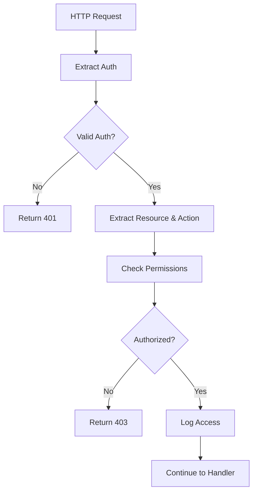

# Ratchet RBAC System Documentation

## Overview

Ratchet implements a comprehensive Role-Based Access Control (RBAC) system with multi-tenant support, providing fine-grained access control across all system resources. The RBAC system is built on top of Casbin policy engine and integrates seamlessly with all Ratchet services.

## Table of Contents

1. [Architecture](#architecture)
2. [Core Concepts](#core-concepts)
3. [Authentication Methods](#authentication-methods)
4. [Authorization Flow](#authorization-flow)
5. [Multi-Tenancy](#multi-tenancy)
6. [Built-in Roles](#built-in-roles)
7. [Development Mode](#development-mode)
8. [Getting Started](#getting-started)

## Architecture

The Ratchet RBAC system consists of several key components:

```
┌─────────────────────────────────────────────────────────┐
│                    RBAC Architecture                     │
├─────────────────────────────────────────────────────────┤
│  Authentication Layer                                    │
│  ┌─────────────┐ ┌─────────────┐ ┌─────────────────────┐│
│  │    JWT      │ │  API Keys   │ │     Sessions        ││
│  │   Tokens    │ │             │ │                     ││
│  └─────────────┘ └─────────────┘ └─────────────────────┘│
├─────────────────────────────────────────────────────────┤
│  Authorization Layer                                     │
│  ┌─────────────┐ ┌─────────────┐ ┌─────────────────────┐│
│  │    Users    │ │    Roles    │ │    Permissions      ││
│  │             │ │             │ │                     ││
│  └─────────────┘ └─────────────┘ └─────────────────────┘│
├─────────────────────────────────────────────────────────┤
│  Policy Engine (Casbin)                                 │
│  ┌─────────────┐ ┌─────────────┐ ┌─────────────────────┐│
│  │   Access    │ │   Resource  │ │     Context         ││
│  │   Control   │ │   Policies  │ │     Rules           ││
│  └─────────────┘ └─────────────┘ └─────────────────────┘│
├─────────────────────────────────────────────────────────┤
│  Storage & Audit                                        │
│  ┌─────────────┐ ┌─────────────┐ ┌─────────────────────┐│
│  │ SeaORM DB   │ │   Casbin    │ │     Audit           ││
│  │  Backend    │ │   Adapter   │ │     Logging         ││
│  └─────────────┘ └─────────────┘ └─────────────────────┘│
└─────────────────────────────────────────────────────────┘
```

## Core Concepts

### Users
Users are authenticated entities that can be assigned roles and permissions. Users can belong to one or more tenants and have different roles within each tenant.

### Roles
Roles are collections of permissions that can be assigned to users. Ratchet supports two types of roles:
- **Platform Roles**: System-wide roles with access across all tenants
- **Tenant Roles**: Roles specific to individual tenants

### Permissions
Permissions define what actions can be performed on specific resources. They follow the format:
```
{resource}:{action}
```

Examples:
- `tasks:read` - Read task information
- `executions:create` - Create new executions
- `users:manage` - Manage user accounts

### Tenants
Tenants provide data isolation and access control boundaries. Each tenant has its own set of users, roles, and resources.

### Resources
Resources are the entities that can be protected by the RBAC system:
- Tasks
- Executions
- Jobs
- Schedules
- Users
- Roles
- Tenants
- Metrics
- Configuration
- API Keys
- Sessions

### Actions
Actions define what operations can be performed on resources:
- `create` - Create new resources
- `read` - View resource information
- `update` - Modify existing resources
- `delete` - Remove resources
- `execute` - Execute tasks or jobs
- `manage` - Full administrative access
- `list` - List resources with filtering

## Authentication Methods

Ratchet supports multiple authentication methods:

### 1. JWT Tokens
JSON Web Tokens for stateless authentication:
```bash
curl -H "Authorization: Bearer <jwt-token>" http://localhost:8080/api/v1/tasks
```

### 2. API Keys
Long-lived tokens for programmatic access:
```bash
curl -H "X-API-Key: <api-key>" http://localhost:8080/api/v1/tasks
```

### 3. Session Cookies
Browser-based authentication with CSRF protection:
```bash
curl -b "session_id=<session-id>" http://localhost:8080/api/v1/tasks
```

## Authorization Flow

1. **Request Arrives**: HTTP request with authentication credentials
2. **Authentication**: Verify user identity using provided credentials
3. **Context Extraction**: Extract resource and action from request
4. **Permission Check**: Query Casbin for access decision
5. **Policy Evaluation**: Apply contextual rules and conditions
6. **Access Decision**: Allow, deny, or require additional verification
7. **Audit Logging**: Record access attempt and decision
8. **Response**: Continue to handler or return authorization error



## Multi-Tenancy

Ratchet's RBAC system provides complete tenant isolation:

### Tenant Domains
Each tenant operates in its own domain:
- Platform domain: `platform`
- Tenant domain: `tenant_{id}`

### Tenant-Scoped Resources
Resources are automatically scoped to the appropriate tenant:
```sql
-- Tasks are automatically filtered by tenant_id
SELECT * FROM tasks WHERE tenant_id = ?
```

### Cross-Tenant Access
Platform administrators can access resources across all tenants with appropriate permissions.

## Built-in Roles

### Platform Roles

#### Platform Administrator
- **Scope**: Platform-wide
- **Permissions**: All operations across all tenants
- **Use Case**: System administrators, DevOps teams

#### Platform Operator
- **Scope**: Platform-wide
- **Permissions**: Read-only access to monitoring, metrics, and system health
- **Use Case**: Monitoring teams, support staff

### Tenant Roles

#### Tenant Administrator
- **Scope**: Single tenant
- **Permissions**: Full administrative access within the tenant
- **Use Case**: Tenant owners, team leads

#### Developer
- **Scope**: Single tenant
- **Permissions**: Create, read, update, and execute tasks and jobs
- **Use Case**: Software developers, automation engineers

#### Operator
- **Scope**: Single tenant
- **Permissions**: Execute tasks, view jobs, monitor executions
- **Use Case**: Operations teams, CI/CD systems

#### Viewer
- **Scope**: Single tenant
- **Permissions**: Read-only access to tasks, jobs, and executions
- **Use Case**: Stakeholders, reporting systems

## Development Mode

For development and testing, Ratchet supports a development mode that disables RBAC:

```bash
# Enable development mode (disables RBAC)
ratchet serve --dev

# Explicit production mode (enables RBAC)
ratchet serve --prod
```

⚠️ **Warning**: Development mode should NEVER be used in production as it allows unrestricted access to all resources.

## Getting Started

### 1. Enable RBAC
Configure RBAC in your server configuration:

```yaml
# config.yaml
development:
  enabled: false  # Ensure development mode is disabled
  disable_rbac: false  # Ensure RBAC is enabled

server:
  auth:
    jwt_secret: "${JWT_SECRET}"
    token_expiration: 3600
```

### 2. Create Initial Admin User
```bash
# Create platform administrator
ratchet user create \
  --username admin \
  --email admin@example.com \
  --role platform_admin \
  --password-prompt
```

### 3. Create Tenant
```bash
# Create a new tenant
ratchet tenant create \
  --name "development" \
  --display-name "Development Team" \
  --admin-user admin
```

### 4. Authenticate
```bash
# Login to get JWT token
curl -X POST http://localhost:8080/api/v1/auth/login \
  -H "Content-Type: application/json" \
  -d '{
    "username": "admin",
    "password": "your-password"
  }'
```

### 5. Use Authenticated Endpoints
```bash
# Use the token for API requests
curl -H "Authorization: Bearer <jwt-token>" \
  http://localhost:8080/api/v1/tasks
```

## Next Steps

- [API Authentication Guide](RBAC_API_GUIDE.md) - Detailed API usage examples
- [Role Management Guide](RBAC_ROLE_MANAGEMENT.md) - Creating and managing custom roles
- [Tenant Management Guide](RBAC_TENANT_MANAGEMENT.md) - Multi-tenant setup and administration
- [Configuration Reference](RBAC_CONFIGURATION.md) - Complete configuration options
- [Troubleshooting Guide](RBAC_TROUBLESHOOTING.md) - Common issues and solutions

## Security Considerations

1. **Secret Management**: Store JWT secrets and API keys securely
2. **Token Rotation**: Regularly rotate authentication tokens
3. **Audit Logging**: Monitor all authentication and authorization events
4. **Principle of Least Privilege**: Grant minimal necessary permissions
5. **Regular Reviews**: Periodically review user roles and permissions

## Performance Notes

- **Authentication**: ~1-2ms overhead per request
- **Authorization**: ~2-5ms overhead per request with caching
- **Policy Evaluation**: Scales linearly with policy complexity
- **Database Queries**: Optimized with proper indexing and connection pooling

For detailed performance optimization, see the [Performance Tuning Guide](RBAC_PERFORMANCE.md).