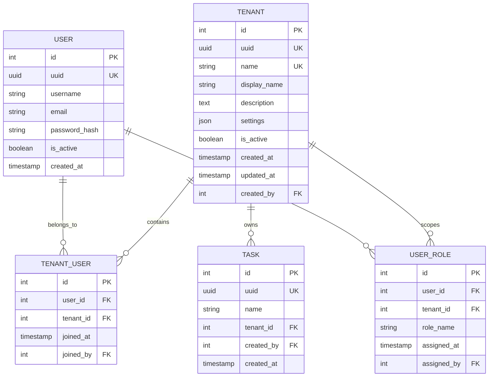

# Ratchet RBAC Tenant Management Guide

This guide covers multi-tenant architecture, tenant setup, user management, and isolation patterns in Ratchet's RBAC system.

## Table of Contents

1. [Multi-Tenancy Overview](#multi-tenancy-overview)
2. [Tenant Architecture](#tenant-architecture)
3. [Tenant Creation](#tenant-creation)
4. [User Management](#user-management)
5. [Resource Isolation](#resource-isolation)
6. [Cross-Tenant Operations](#cross-tenant-operations)
7. [Tenant Configuration](#tenant-configuration)
8. [Migration and Backup](#migration-and-backup)
9. [Monitoring and Analytics](#monitoring-and-analytics)

## Multi-Tenancy Overview

Ratchet's multi-tenant architecture provides complete data isolation and access control between different organizational units, teams, or customers. Each tenant operates as an independent environment with its own users, roles, and resources.

### Key Benefits

- **Data Isolation**: Complete separation of data between tenants
- **Access Control**: Tenant-specific role and permission management
- **Resource Quotas**: Configurable limits per tenant
- **Custom Branding**: Tenant-specific UI customization
- **Independent Scaling**: Per-tenant resource allocation

### Tenant Types

1. **Organization Tenants**: Top-level organizational units
2. **Department Tenants**: Sub-organizational units within companies
3. **Project Tenants**: Project-specific environments
4. **Customer Tenants**: External customer environments

## Tenant Architecture

### Data Model



### Domain Isolation

Each tenant operates in its own domain for Casbin policy enforcement:

- Platform domain: `platform`
- Tenant domain: `tenant_{id}`
- User domain: `user_{id}` (for self-service operations)

### Resource Scoping

All tenant resources are automatically scoped:

```sql
-- Automatic tenant filtering
SELECT * FROM tasks WHERE tenant_id = ?
SELECT * FROM executions WHERE tenant_id = ?
SELECT * FROM jobs WHERE tenant_id = ?
```

## Tenant Creation

### API-Based Creation

#### Create New Tenant
```bash
curl -X POST http://localhost:8080/api/v1/tenants \
  -H "Authorization: Bearer <platform-admin-token>" \
  -H "Content-Type: application/json" \
  -d '{
    "name": "marketing_team",
    "display_name": "Marketing Team",
    "description": "Marketing automation and campaign management",
    "settings": {
      "max_users": 50,
      "max_tasks": 1000,
      "max_executions_per_day": 10000,
      "allowed_task_types": ["javascript", "python"],
      "data_retention_days": 90,
      "timezone": "America/New_York",
      "notification_email": "admin@marketing.example.com"
    }
  }'
```

Response:
```json
{
  "success": true,
  "data": {
    "id": 42,
    "uuid": "550e8400-e29b-41d4-a716-446655440000",
    "name": "marketing_team",
    "display_name": "Marketing Team",
    "description": "Marketing automation and campaign management",
    "settings": {
      "max_users": 50,
      "max_tasks": 1000,
      "max_executions_per_day": 10000,
      "allowed_task_types": ["javascript", "python"],
      "data_retention_days": 90,
      "timezone": "America/New_York",
      "notification_email": "admin@marketing.example.com"
    },
    "is_active": true,
    "created_at": "2024-01-15T10:30:00Z",
    "created_by": 1
  }
}
```

#### Create with Initial Admin
```bash
curl -X POST http://localhost:8080/api/v1/tenants \
  -H "Authorization: Bearer <platform-admin-token>" \
  -H "Content-Type: application/json" \
  -d '{
    "name": "sales_team",
    "display_name": "Sales Team",
    "description": "Sales automation and CRM integration",
    "admin_user": {
      "username": "sales_admin",
      "email": "admin@sales.example.com",
      "password": "secure-password-123",
      "full_name": "Sales Administrator"
    },
    "settings": {
      "max_users": 25,
      "max_tasks": 500
    }
  }'
```

### CLI-Based Creation

```bash
# Create tenant with CLI
ratchet tenant create \
  --name "development" \
  --display-name "Development Team" \
  --description "Development and testing environment" \
  --max-users 20 \
  --max-tasks 100 \
  --admin-email "dev-admin@example.com"

# Create tenant from template
ratchet tenant create \
  --from-template "department_template" \
  --name "hr_team" \
  --display-name "Human Resources" \
  --admin-email "hr-admin@example.com"
```

### Configuration-Based Creation

Define tenant templates in configuration:

```yaml
# config.yaml
tenants:
  templates:
    department_template:
      settings:
        max_users: 30
        max_tasks: 500
        max_executions_per_day: 5000
        data_retention_days: 30
        allowed_task_types: ["javascript", "python", "shell"]
      
      default_roles:
        - name: "admin"
          users: ["${TENANT_ADMIN_EMAIL}"]
        - name: "developer"
          users: []
        - name: "viewer"
          users: []
    
    customer_template:
      settings:
        max_users: 10
        max_tasks: 100
        max_executions_per_day: 1000
        data_retention_days: 7
        allowed_task_types: ["javascript"]
      
      default_roles:
        - name: "admin"
          users: ["${CUSTOMER_ADMIN_EMAIL}"]
        - name: "user"
          users: []
```

## User Management

### Add Users to Tenant

#### Invite Existing User
```bash
curl -X POST http://localhost:8080/api/v1/tenants/42/users \
  -H "Authorization: Bearer <tenant-admin-token>" \
  -H "Content-Type: application/json" \
  -d '{
    "user_id": 123,
    "role": "developer",
    "send_notification": true
  }'
```

#### Create and Add New User
```bash
curl -X POST http://localhost:8080/api/v1/tenants/42/users \
  -H "Authorization: Bearer <tenant-admin-token>" \
  -H "Content-Type: application/json" \
  -d '{
    "user": {
      "username": "newdev",
      "email": "newdev@example.com",
      "password": "secure-password",
      "full_name": "New Developer"
    },
    "role": "developer",
    "send_welcome_email": true
  }'
```

### User Role Management

#### Assign Role to User
```bash
curl -X POST http://localhost:8080/api/v1/tenants/42/users/123/roles \
  -H "Authorization: Bearer <tenant-admin-token>" \
  -H "Content-Type: application/json" \
  -d '{
    "role_name": "operator"
  }'
```

#### Update User Role
```bash
curl -X PATCH http://localhost:8080/api/v1/tenants/42/users/123/roles/developer \
  -H "Authorization: Bearer <tenant-admin-token>" \
  -H "Content-Type: application/json" \
  -d '{
    "role_name": "senior_developer"
  }'
```

#### Remove User from Tenant
```bash
curl -X DELETE http://localhost:8080/api/v1/tenants/42/users/123 \
  -H "Authorization: Bearer <tenant-admin-token>"
```

### Bulk User Operations

#### Bulk User Import
```bash
curl -X POST http://localhost:8080/api/v1/tenants/42/users/bulk \
  -H "Authorization: Bearer <tenant-admin-token>" \
  -H "Content-Type: application/json" \
  -d '{
    "users": [
      {
        "username": "dev1",
        "email": "dev1@example.com",
        "role": "developer"
      },
      {
        "username": "dev2",
        "email": "dev2@example.com",
        "role": "developer"
      },
      {
        "username": "ops1",
        "email": "ops1@example.com",
        "role": "operator"
      }
    ],
    "send_welcome_emails": true,
    "generate_passwords": true
  }'
```

#### CSV Import
```bash
# Import users from CSV file
curl -X POST http://localhost:8080/api/v1/tenants/42/users/import \
  -H "Authorization: Bearer <tenant-admin-token>" \
  -F "file=@users.csv" \
  -F "format=csv" \
  -F "send_notifications=true"
```

CSV format:
```csv
username,email,full_name,role
alice.smith,alice@example.com,Alice Smith,developer
bob.jones,bob@example.com,Bob Jones,operator
carol.wilson,carol@example.com,Carol Wilson,viewer
```

## Resource Isolation

### Automatic Scoping

All resources are automatically scoped to the appropriate tenant:

```rust
// Automatic tenant filtering in repositories
pub async fn list_tasks(&self, tenant_id: i32) -> Result<Vec<Task>> {
    let tasks = task::Entity::find()
        .filter(task::Column::TenantId.eq(tenant_id))
        .all(&self.db)
        .await?;
    Ok(tasks)
}
```

### Cross-Tenant Access Prevention

```rust
// Middleware ensures tenant isolation
pub async fn ensure_tenant_access(
    user: &UserContext,
    requested_tenant_id: i32,
) -> Result<(), AuthError> {
    if !user.has_tenant_access(requested_tenant_id) {
        return Err(AuthError::TenantAccessDenied {
            user_id: user.user_id.clone(),
            tenant_id: requested_tenant_id,
        });
    }
    Ok(())
}
```

### Database Isolation

#### Row-Level Security (RLS)
```sql
-- Enable RLS on tables
ALTER TABLE tasks ENABLE ROW LEVEL SECURITY;

-- Create policies for tenant isolation
CREATE POLICY tenant_isolation_tasks ON tasks
    FOR ALL TO ratchet_user
    USING (tenant_id = current_setting('app.current_tenant_id')::integer);

-- Set tenant context in connections
SET app.current_tenant_id = '42';
```

#### Separate Schemas (Advanced)
```sql
-- Create tenant-specific schemas
CREATE SCHEMA tenant_42;
CREATE SCHEMA tenant_43;

-- Create tables in tenant schemas
CREATE TABLE tenant_42.tasks AS SELECT * FROM public.tasks WHERE FALSE;
CREATE TABLE tenant_43.tasks AS SELECT * FROM public.tasks WHERE FALSE;
```

## Cross-Tenant Operations

### Platform Administrator Access

Platform administrators can access resources across all tenants:

```bash
# List all tenants (platform admin only)
curl -H "Authorization: Bearer <platform-admin-token>" \
  http://localhost:8080/api/v1/tenants

# Access tenant resources
curl -H "Authorization: Bearer <platform-admin-token>" \
  "http://localhost:8080/api/v1/tasks?tenant_id=42"

# Cross-tenant user management
curl -X POST http://localhost:8080/api/v1/users/123/tenants \
  -H "Authorization: Bearer <platform-admin-token>" \
  -H "Content-Type: application/json" \
  -d '{
    "tenant_id": 43,
    "role": "viewer"
  }'
```

### Multi-Tenant Users

Users can belong to multiple tenants with different roles:

```json
{
  "user_id": 123,
  "username": "john.doe",
  "tenant_memberships": [
    {
      "tenant_id": 42,
      "tenant_name": "marketing_team",
      "role": "admin"
    },
    {
      "tenant_id": 43,
      "tenant_name": "sales_team",
      "role": "developer"
    },
    {
      "tenant_id": 44,
      "tenant_name": "support_team",
      "role": "viewer"
    }
  ]
}
```

### Tenant Switching

```bash
# Switch tenant context
curl -X POST http://localhost:8080/api/v1/auth/switch-tenant \
  -H "Authorization: Bearer <user-token>" \
  -H "Content-Type: application/json" \
  -d '{
    "tenant_id": 43
  }'
```

## Tenant Configuration

### Settings Management

#### Update Tenant Settings
```bash
curl -X PATCH http://localhost:8080/api/v1/tenants/42 \
  -H "Authorization: Bearer <tenant-admin-token>" \
  -H "Content-Type: application/json" \
  -d '{
    "settings": {
      "max_users": 75,
      "max_executions_per_day": 15000,
      "notification_webhook": "https://hooks.example.com/tenant42",
      "custom_branding": {
        "logo_url": "https://assets.example.com/marketing-logo.png",
        "primary_color": "#007bff",
        "company_name": "Marketing Division"
      }
    }
  }'
```

### Resource Quotas

#### Set Quotas
```bash
curl -X PUT http://localhost:8080/api/v1/tenants/42/quotas \
  -H "Authorization: Bearer <platform-admin-token>" \
  -H "Content-Type: application/json" \
  -d '{
    "quotas": {
      "max_users": 100,
      "max_tasks": 2000,
      "max_executions_per_hour": 1000,
      "max_storage_mb": 10240,
      "max_api_calls_per_day": 50000
    },
    "enforce_quotas": true
  }'
```

#### Check Quota Usage
```bash
curl -H "Authorization: Bearer <tenant-admin-token>" \
  http://localhost:8080/api/v1/tenants/42/quotas/usage
```

Response:
```json
{
  "success": true,
  "data": {
    "current_usage": {
      "users": 45,
      "tasks": 750,
      "executions_today": 2500,
      "storage_mb": 5120,
      "api_calls_today": 12000
    },
    "quotas": {
      "max_users": 100,
      "max_tasks": 2000,
      "max_executions_per_hour": 1000,
      "max_storage_mb": 10240,
      "max_api_calls_per_day": 50000
    },
    "usage_percentages": {
      "users": 45.0,
      "tasks": 37.5,
      "storage": 50.0,
      "api_calls": 24.0
    }
  }
}
```

### Custom Configurations

#### Feature Flags per Tenant
```yaml
# Tenant-specific feature flags
tenant_features:
  42:  # marketing_team
    advanced_analytics: true
    custom_dashboards: true
    webhook_integrations: true
    sso_enabled: false
  
  43:  # sales_team
    advanced_analytics: false
    custom_dashboards: true
    webhook_integrations: true
    sso_enabled: true
    salesforce_integration: true
```

#### Environment Variables per Tenant
```json
{
  "tenant_id": 42,
  "environment_variables": {
    "MARKETING_API_KEY": "${ENCRYPTED:marketing_api_key}",
    "ANALYTICS_ENDPOINT": "https://analytics.marketing.example.com",
    "NOTIFICATION_CHANNEL": "#marketing-alerts",
    "DEFAULT_TIMEZONE": "America/New_York"
  }
}
```

## Migration and Backup

### Tenant Data Export

```bash
# Export all tenant data
curl -X POST http://localhost:8080/api/v1/tenants/42/export \
  -H "Authorization: Bearer <tenant-admin-token>" \
  -H "Content-Type: application/json" \
  -d '{
    "include": ["users", "roles", "tasks", "executions", "settings"],
    "format": "json",
    "compress": true
  }'
```

### Tenant Migration

```bash
# Migrate tenant to different instance
curl -X POST http://localhost:8080/api/v1/tenants/migrate \
  -H "Authorization: Bearer <platform-admin-token>" \
  -H "Content-Type: application/json" \
  -d '{
    "source_tenant_id": 42,
    "destination": {
      "instance_url": "https://ratchet2.example.com",
      "api_key": "migration_key_123"
    },
    "include_users": true,
    "include_data": true,
    "verification_mode": true
  }'
```

### Backup and Restore

```bash
# Create tenant backup
curl -X POST http://localhost:8080/api/v1/tenants/42/backup \
  -H "Authorization: Bearer <platform-admin-token>" \
  -H "Content-Type: application/json" \
  -d '{
    "backup_name": "marketing_team_backup_20240115",
    "include_user_data": true,
    "include_execution_history": false,
    "retention_days": 30
  }'

# Restore from backup
curl -X POST http://localhost:8080/api/v1/tenants/restore \
  -H "Authorization: Bearer <platform-admin-token>" \
  -H "Content-Type: application/json" \
  -d '{
    "backup_id": "backup_456",
    "target_tenant_id": 42,
    "restore_mode": "full"
  }'
```

## Monitoring and Analytics

### Tenant Metrics

```bash
# Get tenant activity metrics
curl -H "Authorization: Bearer <tenant-admin-token>" \
  "http://localhost:8080/api/v1/tenants/42/metrics?period=7d"
```

Response:
```json
{
  "success": true,
  "data": {
    "period": "7d",
    "metrics": {
      "task_executions": 1250,
      "successful_executions": 1185,
      "failed_executions": 65,
      "average_execution_time_ms": 2340,
      "total_compute_time_ms": 2925000,
      "active_users": 28,
      "api_calls": 15600,
      "storage_used_mb": 5120
    },
    "trends": {
      "executions_change_pct": 12.5,
      "users_change_pct": 3.7,
      "storage_change_pct": 8.2
    }
  }
}
```

### Cross-Tenant Analytics (Platform Admin)

```bash
# Platform-wide tenant comparison
curl -H "Authorization: Bearer <platform-admin-token>" \
  "http://localhost:8080/api/v1/analytics/tenants?metric=executions&period=30d"
```

### Audit Logging

```bash
# Get tenant audit logs
curl -H "Authorization: Bearer <tenant-admin-token>" \
  "http://localhost:8080/api/v1/tenants/42/audit?start_date=2024-01-01&end_date=2024-01-15&limit=100"
```

Response:
```json
{
  "success": true,
  "data": {
    "logs": [
      {
        "timestamp": "2024-01-15T14:30:00Z",
        "user_id": 123,
        "action": "user_added",
        "resource": "tenant_user",
        "details": {
          "target_user_id": 456,
          "role_assigned": "developer"
        }
      },
      {
        "timestamp": "2024-01-15T13:45:00Z",
        "user_id": 123,
        "action": "task_created",
        "resource": "task",
        "details": {
          "task_id": "task_789",
          "task_name": "email_campaign"
        }
      }
    ],
    "total_count": 1250,
    "page": 1,
    "page_size": 100
  }
}
```

### Resource Usage Monitoring

Set up alerts for resource usage:

```yaml
# monitoring.yaml
tenant_alerts:
  - tenant_id: 42
    alerts:
      - metric: "user_count"
        threshold: 90
        threshold_type: "percentage_of_quota"
        action: "email_admin"
      
      - metric: "executions_per_hour"
        threshold: 800
        threshold_type: "absolute"
        action: "throttle_requests"
      
      - metric: "storage_usage"
        threshold: 85
        threshold_type: "percentage_of_quota"
        action: "email_admin_and_users"
```

## Best Practices

### 1. Tenant Naming Conventions
Use consistent naming patterns:
```
{department}_{environment}  # marketing_prod, sales_dev
{customer}_{instance}       # acme_corp_main, beta_corp_test
{project}_{team}           # mobile_app_frontend, api_backend
```

### 2. Resource Quota Planning
Set appropriate quotas based on tenant size:
```json
{
  "small_tenant": {
    "max_users": 10,
    "max_tasks": 100,
    "max_executions_per_day": 1000
  },
  "medium_tenant": {
    "max_users": 50,
    "max_tasks": 500,
    "max_executions_per_day": 10000
  },
  "large_tenant": {
    "max_users": 200,
    "max_tasks": 2000,
    "max_executions_per_day": 50000
  }
}
```

### 3. Security Isolation
Ensure proper tenant isolation:
- Use row-level security in databases
- Implement middleware validation
- Audit cross-tenant access attempts
- Regular security reviews

### 4. Performance Optimization
Optimize for multi-tenant performance:
- Index tenant_id columns
- Partition large tables by tenant
- Use connection pooling per tenant
- Cache tenant configurations

### 5. Backup Strategy
Implement tenant-specific backup policies:
```yaml
backup_policies:
  critical_tenants:
    frequency: "hourly"
    retention: "90d"
    include_history: true
  
  standard_tenants:
    frequency: "daily"
    retention: "30d"
    include_history: false
  
  test_tenants:
    frequency: "weekly"
    retention: "7d"
    include_history: false
```

For advanced multi-tenant configurations and enterprise patterns, see the [Enterprise Tenant Management](RBAC_ENTERPRISE_TENANTS.md) guide.